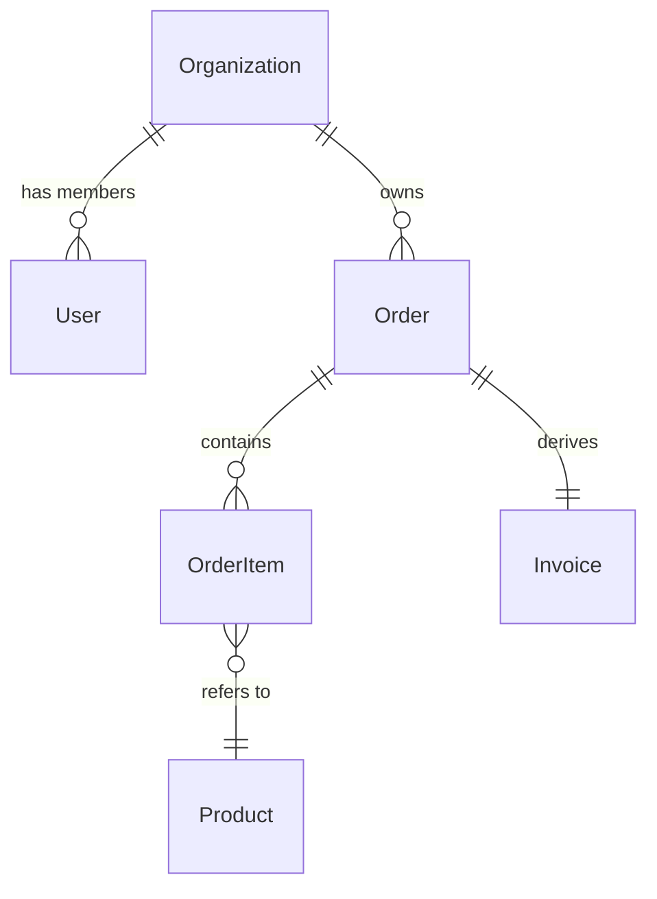
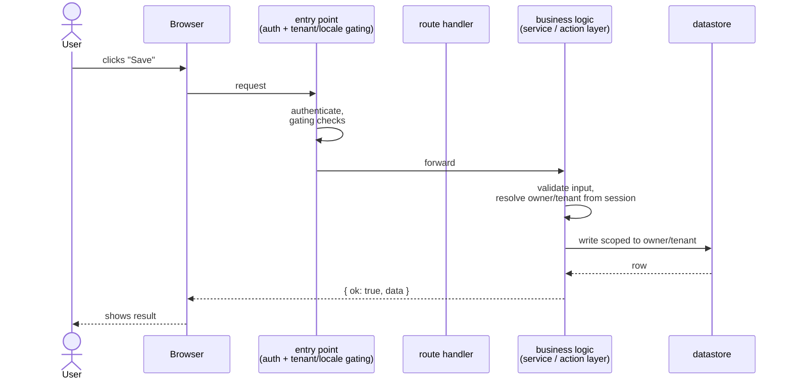
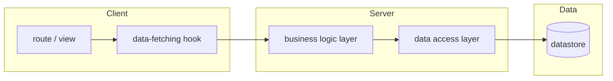
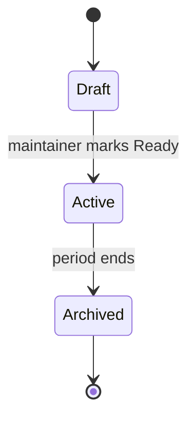

# Architecture Diagram

Generate clean, minimal Mermaid diagrams that make a design decision easier to grasp at a glance. **Diagrams are aids, not deliverables** — they accompany prose, they don't replace it. The architect agent invokes this skill when prose alone would force the reader to assemble a picture in their head.

## When to invoke

Invoke for:

- **Schema changes** that introduce new entities, new relations, or rework FK direction → ER diagram.
- **Request flow changes** that touch multiple layers (middleware/gateway → route/page → business logic layer → DB) → sequence diagram.
- **Module composition changes** that introduce a new boundary or rearrange dependencies → flowchart.
- **State machines** with non-trivial transitions (e.g., an order lifecycle, a derived-record regeneration flow) → state diagram.

Skip for:

- Trivial design questions ("should this constant live in utils or in the component?"). Prose is enough.
- Schema additions of a single column. Mention it in text; a diagram is overkill.
- Renames, dep bumps, file moves.

If you're not sure whether a diagram adds value, **don't generate one**. The maintainer values restraint; a diagram that just restates the prose is noise.

## Project facts to encode honestly

When generating diagrams for this project, use the project's actual conventions — don't draw a generic textbook architecture and call it this project's.

Before drawing, ground the diagram in facts you've actually read from the codebase, not from memory or assumption. Things to nail down and encode correctly:

- **Request path (today):** [FILL IN — trace the real path: entry point (gateway/middleware/proxy, including any auth or locale/tenant gating it does) → routing/layout layer → business-logic layer (page handler, server action, controller) → data-access layer → datastore. Name the actual files/modules once you know them.]
- **Schema models that exist today:** [FILL IN — list the actual entities, and which are tenant-scoped vs shared/global. Find the authoritative schema (migration files, ORM schema, DDL) and read it before drawing — don't reconstruct relations from memory.]
- **Non-obvious field encodings** — e.g. an enum or numeric field whose meaning isn't self-evident (a day-of-week field that starts at a non-obvious index, a status code that isn't 0-indexed the way you'd guess). If you draw it, label it with its real meaning, not the obvious-looking one.
- **Cardinality rules that are easy to get wrong** — e.g. "one X per Y, not many-to-many." Don't draw a relation more permissive than the schema actually allows.
- **Entities intentionally shared across tenants/owners** — if an entity is deliberately *not* scoped to a tenant or owner, don't draw the scoping foreign key on it anyway just because its siblings have one.
- **Derived/computed data** — if one entity is computed or regenerated from others rather than written independently, show the derivation arrow in flow diagrams, not a parallel write.
- **Integrations that are designed but not yet wired up** — if a diagram includes a flow that doesn't exist in the running system yet (e.g. a webhook that's planned but not implemented), mark it `--dashed-->` or label it "(not yet wired)" — don't pretend it exists.

If you didn't read the schema or the live code for the area you're diagramming, say so and stop. **Never invent relations, models, or flows.** The maintainer's standing no-fabrication rule applies with extra weight to diagrams because a wrong arrow is harder to spot than a wrong sentence.

## Output format

Embed the diagram as a fenced Mermaid block inside the architect's larger design report. Each diagram has a one-sentence caption above it explaining what to look at — readers skim diagrams; the caption is what makes the skim succeed.

```markdown
**Diagram — <what it shows>.** <One sentence: the thing the reader should notice.>

\`\`\`mermaid
<diagram code>
\`\`\`
```

The diagram lives in the conversation (or in an ADR / feature brief the maintainer pastes it into). This skill does **not** write files to disk — same rule as the architect itself. The architect produces the draft; the maintainer or the main agent commits anything that lands.

## Diagram templates (use as starting points, then prune)

### ER (entity-relationship) — for schema changes



(Entity names above are illustrative placeholders — substitute your project's real domain model. The point being demonstrated is the *shape*: an owning tenant entity, a composed aggregate, a shared reference entity, and one entity derived from another.)

Illustrative examples throughout this doc use a generic customer/order/product domain — swap in whatever fits the project at hand.

Rules:
- Only include entities relevant to the change. A diagram of all ten models is noise; a diagram of the three involved in the decision is signal.
- Mark **new** entities/relations with a comment-style note above the diagram, or use a separate "after" block next to a "before" block.
- Don't include scalar attributes unless the change is *about* attributes. If you do, list 2–4 max.

### Sequence — for request-flow changes



Rules:
- Show the **boundary crossings**, not every function call. 5–10 messages is the sweet spot.
- Use `<<` self-loops sparingly — they're for emphasizing a non-trivial step (auth, validation, transaction).
- Label edges with the *intent*, not the type signature.

### Flowchart — for module composition



Rules:
- Group related nodes in subgraphs that match real boundaries (client/server/data, or feature/shared/external).
- Don't draw a node per file — draw a node per role. A `flowchart` is for architecture, not file listings.
- Direction: `LR` (left-to-right) usually reads more naturally than `TB` for request flows.

### State — for lifecycle / state-machine designs



Rules:
- One node per stable state. Transient sub-states usually don't belong.
- Label every transition with the *trigger*, not the *consequence*.
- Reserve for designs where the state machine is the load-bearing decision.

## Reader-test before shipping the diagram

Before handing the diagram back, ask yourself one question: **does this diagram help a smart non-author understand the decision faster than reading the prose alone?**

If yes, keep it. If no — if it just restates the prose, or requires the prose to be understood at all, or includes detail the reader doesn't need to grasp the decision — **drop it**. A skipped diagram is better than a diagram that adds friction.

If two diagrams would help (e.g., "before" vs "after"), make both. But if a single diagram needs more than ~25 lines of Mermaid to express the idea, the idea is too big for one diagram — split it.

## Failure handling

- If the Mermaid syntax breaks (the renderer in the maintainer's tool refuses to parse), report the failure with the broken code so they can paste it into the Mermaid live editor and see the error. Do not pretend the diagram rendered.
- If the maintainer's renderer doesn't support a specific Mermaid feature (e.g., `stateDiagram-v2`), fall back to the simpler `stateDiagram` or `flowchart` form and note the substitution.
- If you don't know the answer (e.g., "what's the FK direction here?"), open the schema. If you can't determine it from the code, mark the arrow with `?` and flag it as an open question in the architect's report rather than guessing.

## What this skill does NOT do

- It does not write files. Diagrams go in the architect's report and follow that report's destination (conversation, ADR, brief).
- It does not replace the architect's prose Output format. The diagram supplements the report; the report still includes Problem / Options / Recommendation / Risks.
- It does not produce non-Mermaid formats (PlantUML, Graphviz, draw.io). If the maintainer needs those, that's a tooling change outside this skill's scope.
