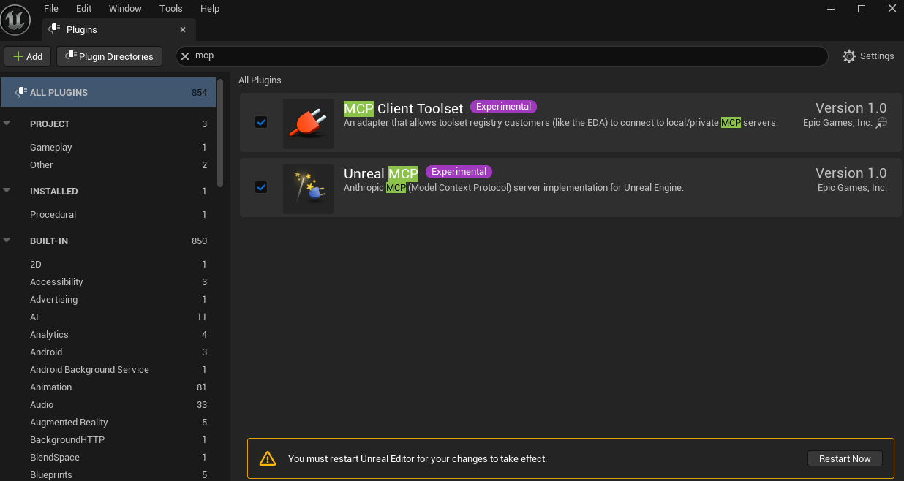
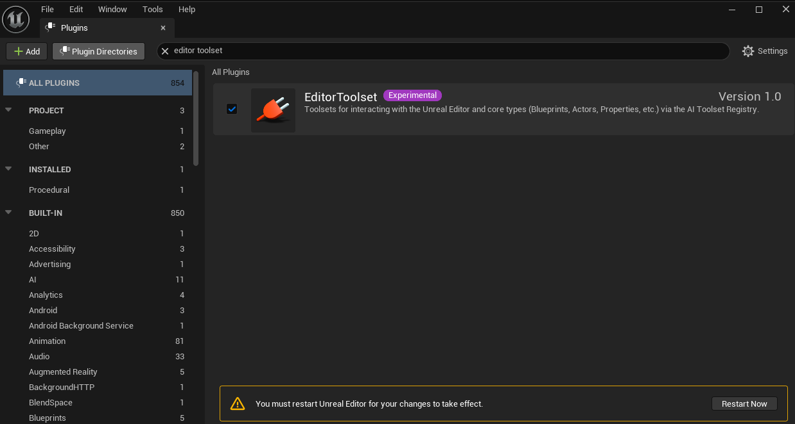
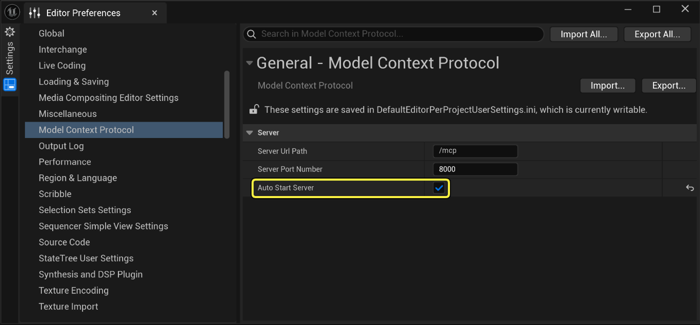

# Manual setup

Everything `/unlock-unreal` does, done by hand.

**You probably don't need this page.** In Claude Code, `/unlock-unreal` performs every step below, verifies the result with a live round trip, and reports what it did. This doc exists for three cases: you want to understand what the skill is doing before letting it run, something failed and you're diagnosing it, or you'd simply rather do it yourself.

Each step gives the editor UI route and the config-file equivalent, because the skill uses the config files — they work with the editor closed and are what make the setup reproducible.

---

## 1. Install Unreal Engine 5.8

Install UE 5.8 through the Epic Games Launcher, then create or open your project.

**If you want VibeUE, the project must be C++.** Pick a C++ template at creation. A Blueprint-only project can be converted afterwards (see [step 6](#6-convert-a-blueprint-only-project-to-c-optional)), but it's less work to start there.

You do *not* need C++ for MCP itself — see the note at the end about what each layer requires.

## 2. Enable the plugins

**Edit → Plugins**, then enable these and restart when prompted:

| Plugin | Gives you |
|---|---|
| **Unreal MCP** (`ModelContextProtocol`) | the `unreal-mcp` server itself |
| **MCP Client Toolset** (`MCPClientToolset`) | client-side toolset plumbing |
| **EditorToolset** | Epic's editor toolsets — actors, assets, scene, PIE, screenshots |
| **Python Editor Script Plugin** (`PythonScriptPlugin`) | `import unreal` scripting |
| **Editor Scripting Utilities** | editor automation library Python relies on |
| **Remote Control API** (`RemoteControl`) | HTTP/WebSocket API on ports 30010 / 30020 |

Search `mcp` for the first two:



Search `editor toolset` for the third:



**Config-file equivalent** — add to the `Plugins` array in your `.uproject`:

```json
{ "Name": "ModelContextProtocol", "Enabled": true },
{ "Name": "MCPClientToolset",     "Enabled": true },
{ "Name": "EditorToolset",        "Enabled": true },
{ "Name": "PythonScriptPlugin",   "Enabled": true },
{ "Name": "EditorScriptingUtilities", "Enabled": true },
{ "Name": "RemoteControl",        "Enabled": true }
```

Expect the next launch to be slow — plugins pull in their own dependencies.

## 3. Make the MCP server start automatically

**MCP does not auto-start by default.** Without this you'd have to run a console command every session.

**Edit → Editor Preferences → Model Context Protocol** → tick **Auto Start Server** (defaults: port `8000`, path `/mcp`):



**Config-file equivalent** — `Config/DefaultEditorPerProjectUserSettings.ini`:

```ini
[/Script/ModelContextProtocolEngine.ModelContextProtocolSettings]
bAutoStartServer=True
ServerPortNumber=8000
```

Official docs: [Unreal MCP in Unreal Editor](https://dev.epicgames.com/documentation/unreal-engine/unreal-mcp-in-unreal-editor?lang=en-US).

## 4. Register the server with Claude Code

The folder you run `claude` in needs a `.mcp.json`:

```json
{ "mcpServers": { "unreal-mcp": { "type": "http", "url": "http://127.0.0.1:8000/mcp" } } }
```

The editor can generate it for you — in the Output Log's Cmd box:

```
ModelContextProtocol.GenerateClientConfig ClaudeCode
```

**Port 8000 is shared.** Only one editor can serve MCP at a time, so if you drive several Unreal projects, whichever editor is running is the one Claude Code reaches.

## 5. Install Claude Code

Follow the [official setup guide](https://code.claude.com/docs/en/setup#install-claude-code). Then copy this repo's `.claude/` directory and `LOCAL.md.example` into your workspace root and start `claude` there.

At this point MCP works. Steps 6 and 7 are only for VibeUE.

## 6. Convert a Blueprint-only project to C++ (optional)

Needed only if you want VibeUE, which is a C++ editor plugin and needs a module to compile against.

Easiest route: **File → New C++ Class** in the editor, add any class, let it compile. That generates `Source/` and the module for you.

By hand, replacing `<YourProject>` with your project name exactly:

- `Source/<YourProject>.Target.cs` and `Source/<YourProject>Editor.Target.cs` — `TargetType.Game` / `.Editor`, `DefaultBuildSettings = BuildSettingsVersion.V7`, `IncludeOrderVersion = EngineIncludeOrderVersion.Unreal5_8`, `ExtraModuleNames.Add("<YourProject>")`
- `Source/<YourProject>/<YourProject>.Build.cs` — `PCHUsage = PCHUsageMode.UseExplicitOrSharedPCHs`, public deps `Core, CoreUObject, Engine, InputCore`
- `Source/<YourProject>/<YourProject>.h` — `#pragma once` and `#include "CoreMinimal.h"`
- `Source/<YourProject>/<YourProject>.cpp` — `IMPLEMENT_PRIMARY_GAME_MODULE( FDefaultGameModuleImpl, <YourProject>, "<YourProject>" );`
- In the `.uproject`, before `Plugins`:

```json
"Modules": [ { "Name": "<YourProject>", "Type": "Runtime", "LoadingPhase": "Default" } ],
```

Back up the `.uproject` first — it's the only pre-existing file that changes. To undo: restore it and delete `Source/`, `Plugins/VibeUE`, `Binaries/`, `Intermediate/`.

**From here on, every C++ build needs the editor closed.** That's the standing cost of a C++ project.

## 7. Install and build VibeUE (optional)

[VibeUE](https://github.com/Johan-p/VibeUE) adds ~26 authoring toolsets on top of Epic's — Blueprints, UMG/MVVM, material graphs, MetaSounds, Niagara, Landscape, Foliage, animation, UV mapping, undo/redo, and Unreal Insights profiling — plus `execute_python_code`.

Work from the fork, never upstream:

```powershell
git clone https://github.com/Johan-p/VibeUE "<UnrealProjectDir>\Plugins\VibeUE"
```

Close the editor, then build:

```powershell
& "C:\Program Files\Epic Games\UE_5.8\Engine\Build\BatchFiles\Build.bat" <YourProject>Editor Win64 Development -Project="<UnrealProjectDir>\<YourProject>.uproject" -WaitMutex
```

Success is `Result: Succeeded`. Budget around 8 minutes for a fresh module plus the plugin. The engine path above is the default install location — substitute yours if it differs, and record it in `LOCAL.md` so skills can reference it as `<UnrealEngineDir>` instead of hardcoding it.

Then relaunch and generate the agent guide from the editor console:

```
VibeUE.GenerateAgentConfig ClaudeCode
```

## 8. Verify

Launch the editor and check, in this order:

1. **Server listening** — open `http://127.0.0.1:8000/mcp` in a browser. A **405** is correct and means success; it wants POST, not GET. Connection refused means auto-start didn't take.
2. **Tools bound in Claude Code** — the harness attaches lazily, so give it a call or two. If they still don't appear, run `/mcp` and reconnect `unreal-mcp`.
3. **Round trip** — ask Claude to list the MCP toolsets. Expect ~19 from Epic, plus ~26 more if VibeUE is installed.
4. **Python** — check the editor log for `LogPython: Using Python 3.11.8`.

A build succeeding and a plugin working are different claims. Only step 3 proves the second.

## 9. Remote Control for HTTP scripting (optional)

Only needed if you want to drive the editor from something other than Claude Code, or you skipped the C++ conversion but still want Python.

Remote Control's **web servers already auto-start** (`bAutoStartWebServer` and `bAutoStartWebSocketServer` both default to true, on ports 30010 and 30020). The `WebControl.StartServer` and `WebControl.EnableServerOnStartup` commands older guides recommend are unnecessary in 5.8.

What *is* off by default is the ability to call anything. **`bAllowAnyRemoteFunctionCall` alone is not enough** — Python and console commands are gated behind their own separate flags.

There's a second, less obvious problem: the engine binds the HTTP server to `127.0.0.1` but defaults the **WebSocket and web-interface listeners to `0.0.0.0`** — every network interface. Turn on the execution flags without fixing that and you've published arbitrary code execution in your editor to the whole local network, with only your host firewall in the way. It's easy to miss because port 30010, the one you'd naturally test, looks correctly bound.

Write all of these together, and never the execution flags without the bind addresses (note the module is `RemoteControlCommon`):

```ini
[/Script/RemoteControlCommon.RemoteControlSettings]
bAllowAnyRemoteFunctionCall=True
bEnableRemotePythonExecution=True
bAllowConsoleCommandRemoteExecution=True
bRestrictServerAccess=True
bEnforcePassphraseForRemoteClients=True

; Engine defaults these two to 0.0.0.0 — pin them to loopback.
RemoteControlWebsocketServerBindAddress=127.0.0.1
RemoteControlWebInterfaceBindAddress=127.0.0.1
```

Then check it actually took:

```powershell
Get-NetTCPConnection -State Listen -LocalPort 8000,30010,30020 | Select-Object LocalAddress, LocalPort
```

Every row must read `127.0.0.1`. A `0.0.0.0` means the setting didn't apply.

> **Security.** This enables arbitrary code execution over a network port. `bRestrictServerAccess=True` gates off-machine callers behind allowlist and passphrase checks, but treat the loopback binding as the real boundary — an allowlist you haven't populated is a policy, while a socket bound to loopback is a fact. Never expose Remote Control to the internet.

Call Python via `PUT /remote/object/call` on `/Script/PythonScriptPlugin.Default__PythonScriptLibrary`, function `ExecutePythonCommandEx`, with `ExecutionMode: ExecuteFile`. (`EvaluateStatement` only accepts a single expression and throws `SyntaxError` on multi-line scripts.)

---

## What each layer actually needs

A common misconception is that VibeUE provides MCP. It doesn't:

| You want | You need |
|---|---|
| `unreal-mcp` server + Epic's ~19 toolsets | Steps 2–4. **No C++ required.** |
| Python scripting | Step 2 (`PythonScriptPlugin`) + either VibeUE or step 9 |
| VibeUE's ~26 authoring toolsets | C++ project (step 6) + step 7 |
| HTTP/WebSocket access from other tools | Steps 2 and 9 |

Setup is all filesystem and config work — none of it needs a running editor. MCP is the *runtime* channel: it drives the editor and proves the rest actually worked.
